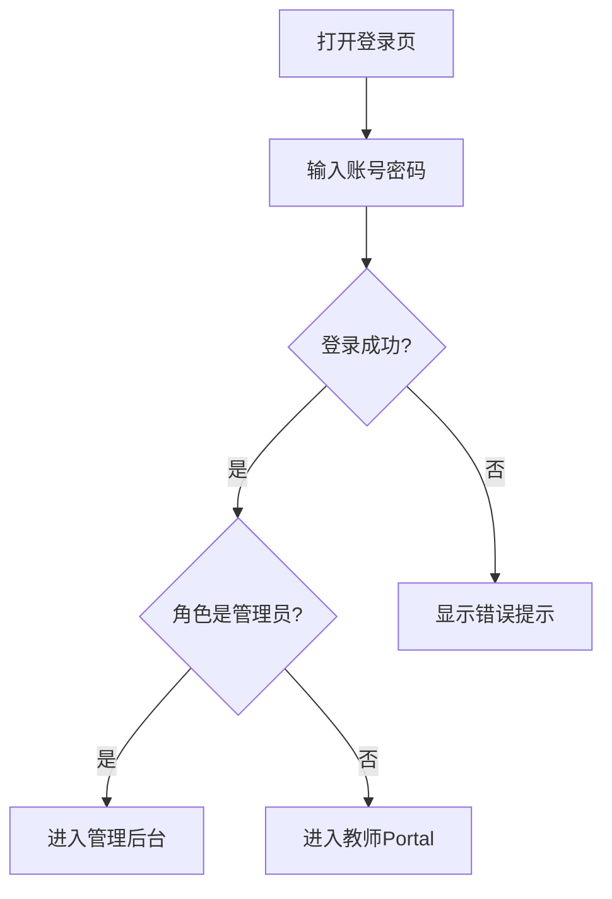
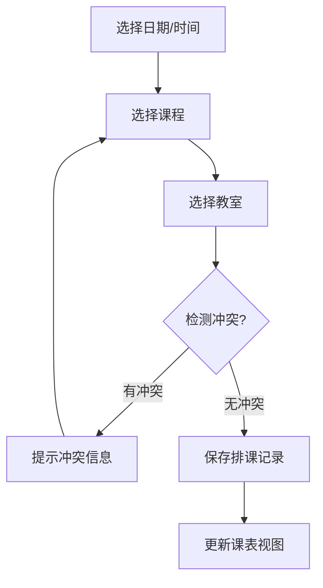
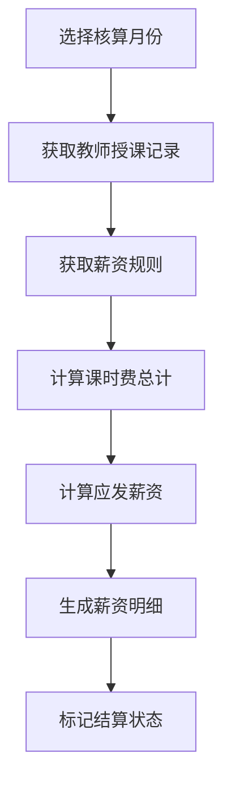

# 产品需求文档 (PRD) - edulab 轻量级教培管理系统

## 1. 产品概述

edulab 是一款面向中小型线下教培机构的轻量化综合管理平台，专注解决学员、课程、排课、教师、薪资五大核心业务的管理需求。系统采用前后端分离架构，极简设计、低资源占用，支持 Docker 一键部署，内存占用控制在 1000MB 以内。

### 目标用户
- 中小型线下教培机构管理员
- 教培机构教师（只读自身数据）
- 机构运营人员

### 核心价值
- 一体化管理：学员、课程、教师、薪资全覆盖
- 轻量化运行：低配电脑/服务器即可运行
- 快速部署：Docker Compose 一键启动

---

## 2. 功能模块

### 2.1 用户角色

| 角色 | 说明 | 权限范围 |
|------|------|----------|
| 管理员 | 系统超级用户 | 全部功能读写 |
| 教师 | 授课老师 | 仅查看自身课表、薪资、学员信息 |

### 2.2 功能列表

#### 学员管理模块
- 学员档案管理（姓名、联系方式、年龄、年级、状态）
- 报名、续费、缴费记录管理
- 学员上课签到功能
- 数据检索、筛选、导出功能

#### 课程与排课模块
- 课程信息管理（科目、课时、费用）
- 教室管理
- 按周/按月排课
- 教师/学员双视角课表
- 排课冲突检测

#### 教师管理模块
- 教师档案管理（基本信息、科目、底薪、课时费）
- 授课记录与课时统计
- 权限控制（教师角色只读自身数据）

#### 薪资管理模块（核心）
- 薪资规则配置
- 按月自动核算薪资
- 薪资明细、结算状态管理
- 导出 Excel 工资表

#### 数据看板模块
- 学员总数
- 教师数
- 今日课程数
- 当月薪资概览

#### 系统管理模块
- 账号权限管理（管理员/教师）
- 密码修改
- 数据备份
- 操作日志查看

---

## 3. 页面清单

| 序号 | 页面名称 | 所属模块 | 核心功能描述 |
|------|----------|----------|--------------|
| 1 | 登录页 | 系统 | 账号密码登录，角色自动识别 |
| 2 | 数据看板 | 首页 | 概览统计数据，卡片式布局 |
| 3 | 学员列表 | 学员管理 | 学员档案列表，支持搜索/筛选/导出 |
| 4 | 学员详情 | 学员管理 | 学员个人信息、缴费记录、签到记录 |
| 5 | 课程列表 | 课程管理 | 课程信息管理，增删改查 |
| 6 | 教室管理 | 课程管理 | 教室信息配置 |
| 7 | 排课管理 | 排课 | 按周/月视图排课，冲突检测 |
| 8 | 教师课表 | 排课 | 教师视角课表展示 |
| 9 | 学员课表 | 排课 | 学员视角课表展示 |
| 10 | 教师列表 | 教师管理 | 教师档案列表 |
| 11 | 教师详情 | 教师管理 | 教师信息、授课统计 |
| 12 | 薪资规则 | 薪资管理 | 薪资规则配置 |
| 13 | 薪资核算 | 薪资管理 | 月度薪资自动核算 |
| 14 | 薪资明细 | 薪资管理 | 薪资明细查看/导出 |
| 15 | 账号管理 | 系统管理 | 管理员/教师账号管理 |
| 16 | 操作日志 | 系统管理 | 系统操作记录查看 |
| 17 | 数据备份 | 系统管理 | 备份功能 |

---

## 4. 核心流程

### 4.1 用户登录流程

### 4.2 排课流程

### 4.3 薪资核算流程

---

## 5. 视觉设计规范

### 5.1 设计风格
- **风格定位**：专业、高效、简洁的企业级管理后台
- **设计语言**：Element Plus 组件库为基础，保持风格统一
- **动效策略**：轻量过渡动画，避免复杂效果影响性能

### 5.2 色彩规范

| 用途 | 色值 | 说明 |
|------|------|------|
| 主色调 | #409EFF | Element Plus 默认蓝，用于主要按钮、链接 |
| 成功色 | #67C23A | 用于成功状态、已完成 |
| 警告色 | #E6A23C | 用于警告、待处理 |
| 危险色 | #F56C6C | 用于错误、删除 |
| 背景色 | #F5F7FA | 页面背景色 |
| 文字主色 | #303133 | 主要文字 |
| 文字次色 | #909399 | 次要文字、说明 |

### 5.3 字体规范
- **主字体**：系统默认 sans-serif（保持性能）
- **标题字号**：18-24px
- **正文字号**：14px
- **辅助字号**：12px

### 5.4 布局规范
- **整体布局**：侧边导航 + 顶部栏 + 主内容区
- **导航模式**：左侧固定侧边栏，支持折叠
- **内容区**：卡片式布局，间距统一 16px/24px
- **响应式**：桌面端优先，支持 1024px 以上屏幕

### 5.5 组件规范
- 使用 Element Plus 组件，按需引入
- 表格统一使用 el-table，支持排序、筛选
- 表单统一使用 el-form，验证规则一致
- 按钮操作区统一放在右侧或底部

---

## 6. 数据导出

### 6.1 导出功能
- 学员列表导出：Excel 格式
- 薪资明细导出：Excel 格式
- 签到记录导出：Excel 格式

---

## 7. 验收标准

### 7.1 功能验收
- [ ] 登录/登出功能正常
- [ ] 管理员可管理所有数据
- [ ] 教师仅可查看自身数据
- [ ] 学员CRUD功能完整
- [ ] 课程CRUD功能完整
- [ ] 排课功能完整，支持冲突检测
- [ ] 薪资核算逻辑正确
- [ ] 薪资导出功能正常
- [ ] 数据看板数据准确

### 7.2 非功能验收
- [ ] 页面加载时间 < 2s
- [ ] 内存占用 < 1000MB
- [ ] Docker 部署一次成功
- [ ] 无明显前端性能问题
