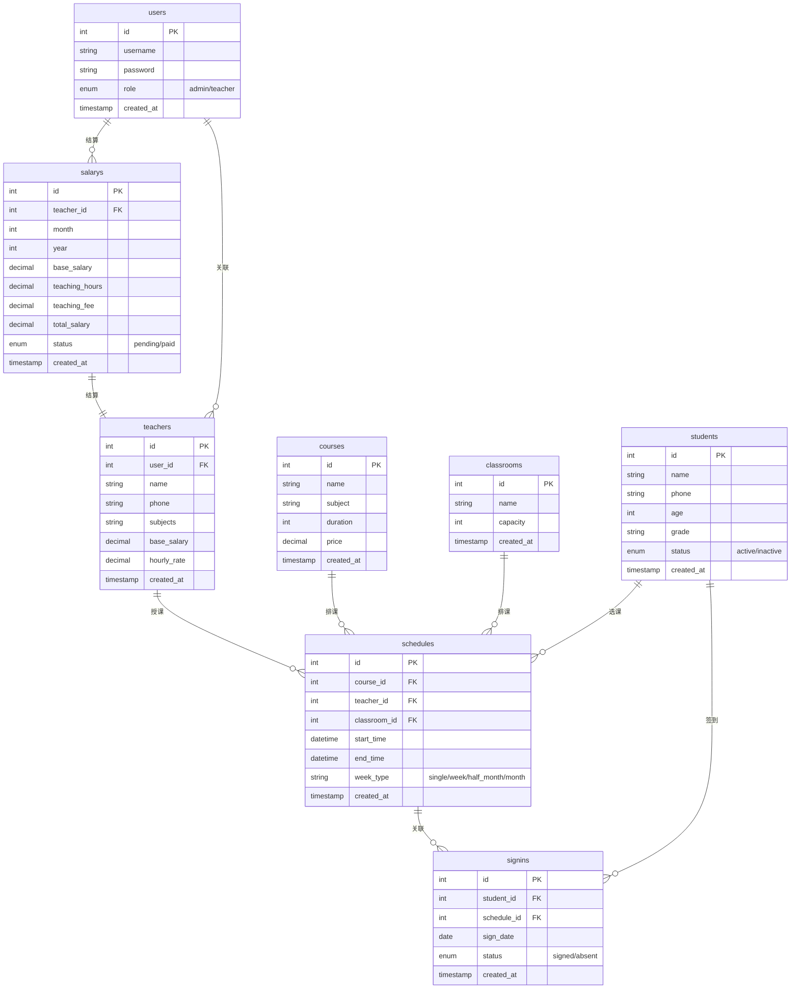
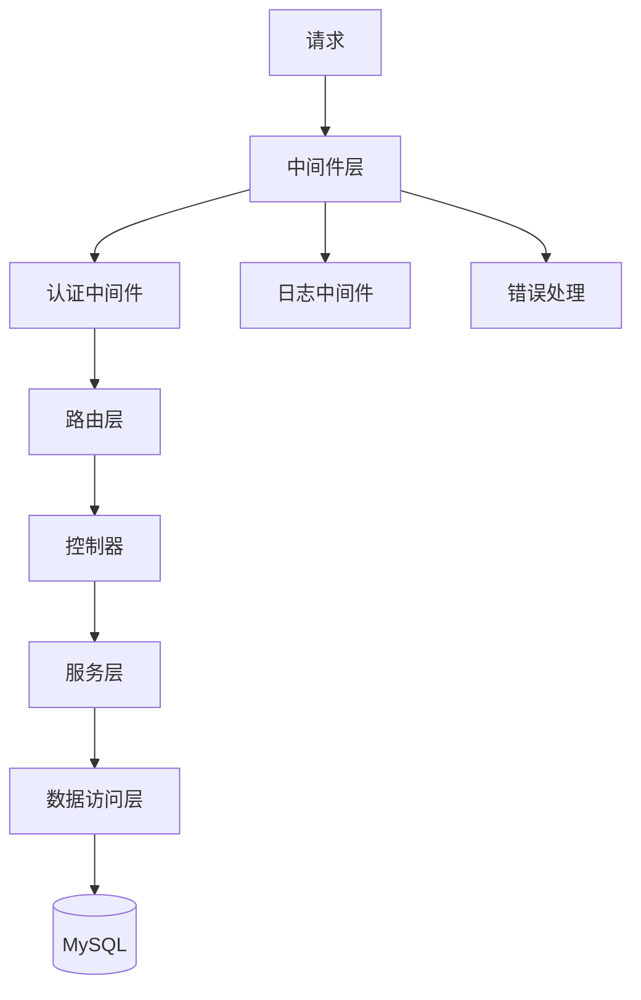

# 技术架构文档 - edulab 轻量级教培管理系统

## 1. 架构设计

### 1.1 整体架构


### 1.2 技术栈概览

| 层级 | 技术选型 | 说明 |
|------|----------|------|
| 前端框架 | Vue3 + Vite | 组合式 API + TypeScript |
| UI 组件库 | Element Plus | 按需引入，减少体积 |
| HTTP 客户端 | Axios | API 请求封装 |
| 后端框架 | Node.js + Express | 轻量 RESTful API |
| ORM | Sequelize | MySQL 数据模型管理 |
| 数据库 | MySQL 8.0+ | 关系型数据存储 |
| 部署 | Docker + Docker Compose | 容器化部署 |

---

## 2. 项目结构

```
edulab/
├── LICENSE                 # Apache-2.0 协议
├── README.md               # 项目说明
├── docker-compose.yml      # Docker 编排
├── Dockerfile              # 应用镜像构建
├── .gitignore
├── .dockerignore
├── frontend/               # 前端项目
│   ├── src/
│   │   ├── api/           # API 请求封装
│   │   ├── components/    # 公共组件
│   │   ├── composables/   # 组合式函数
│   │   ├── pages/         # 页面组件
│   │   ├── router/        # 路由配置
│   │   ├── stores/        # 状态管理
│   │   ├── types/         # TypeScript 类型
│   │   ├── utils/         # 工具函数
│   │   ├── App.vue
│   │   └── main.ts
│   ├── index.html
│   ├── package.json
│   ├── vite.config.ts
│   └── tsconfig.json
├── backend/                # 后端项目
│   ├── src/
│   │   ├── controllers/   # 控制器
│   │   ├── services/     # 业务逻辑
│   │   ├── models/        # Sequelize 模型
│   │   ├── routes/        # 路由定义
│   │   ├── middlewares/   # 中间件
│   │   ├── config/        # 配置文件
│   │   ├── utils/         # 工具函数
│   │   └── app.ts
│   ├── package.json
│   └── tsconfig.json
└── docs/                   # 文档目录
```

---

## 3. 技术详细说明

### 3.1 前端技术详情

**核心依赖：**
- vue: ^3.4
- vue-router: ^4.2
- pinia: ^2.1 (状态管理)
- element-plus: ^2.5 (UI组件)
- axios: ^1.6 (HTTP客户端)
- @vueuse/core: ^10.7 (组合式工具)

**项目初始化：**
```
pnpm create vite-init@latest . --template vue-ts
```

**按需引入：**
Element Plus 使用 unplugin-vue-components 实现自动导入。

### 3.2 后端技术详情

**核心依赖：**
- express: ^4.18
- sequelize: ^6.35
- mysql2: ^3.7
- jsonwebtoken: ^9.0 (JWT认证)
- bcryptjs: ^2.4 (密码加密)
- cors: ^2.8 (跨域处理)
- dotenv: ^16.3 (环境变量)
- xlsx: ^0.18 (Excel导出)

**项目初始化：**
使用 TypeScript + ESM 模式。

### 3.3 数据库设计

#### ER 图



### 3.4 数据库表结构 DDL

```sql
-- 用户表
CREATE TABLE `users` (
  `id` INT PRIMARY KEY AUTO_INCREMENT,
  `username` VARCHAR(50) UNIQUE NOT NULL,
  `password` VARCHAR(255) NOT NULL,
  `role` ENUM('admin', 'teacher') NOT NULL DEFAULT 'teacher',
  `created_at` TIMESTAMP DEFAULT CURRENT_TIMESTAMP,
  `updated_at` TIMESTAMP DEFAULT CURRENT_TIMESTAMP ON UPDATE CURRENT_TIMESTAMP
);

-- 教师表
CREATE TABLE `teachers` (
  `id` INT PRIMARY KEY AUTO_INCREMENT,
  `user_id` INT UNIQUE,
  `name` VARCHAR(100) NOT NULL,
  `phone` VARCHAR(20),
  `subjects` VARCHAR(255),
  `base_salary` DECIMAL(10, 2) DEFAULT 0,
  `hourly_rate` DECIMAL(10, 2) DEFAULT 0,
  `created_at` TIMESTAMP DEFAULT CURRENT_TIMESTAMP,
  `updated_at` TIMESTAMP DEFAULT CURRENT_TIMESTAMP ON UPDATE CURRENT_TIMESTAMP,
  FOREIGN KEY (`user_id`) REFERENCES `users`(`id`)
);

-- 学员表
CREATE TABLE `students` (
  `id` INT PRIMARY KEY AUTO_INCREMENT,
  `name` VARCHAR(100) NOT NULL,
  `phone` VARCHAR(20),
  `age` INT,
  `grade` VARCHAR(50),
  `status` ENUM('active', 'inactive') DEFAULT 'active',
  `created_at` TIMESTAMP DEFAULT CURRENT_TIMESTAMP,
  `updated_at` TIMESTAMP DEFAULT CURRENT_TIMESTAMP ON UPDATE CURRENT_TIMESTAMP
);

-- 课程表
CREATE TABLE `courses` (
  `id` INT PRIMARY KEY AUTO_INCREMENT,
  `name` VARCHAR(100) NOT NULL,
  `subject` VARCHAR(50),
  `duration` INT COMMENT '课时数',
  `price` DECIMAL(10, 2),
  `created_at` TIMESTAMP DEFAULT CURRENT_TIMESTAMP,
  `updated_at` TIMESTAMP DEFAULT CURRENT_TIMESTAMP ON UPDATE CURRENT_TIMESTAMP
);

-- 教室表
CREATE TABLE `classrooms` (
  `id` INT PRIMARY KEY AUTO_INCREMENT,
  `name` VARCHAR(100) NOT NULL,
  `capacity` INT,
  `created_at` TIMESTAMP DEFAULT CURRENT_TIMESTAMP,
  `updated_at` TIMESTAMP DEFAULT CURRENT_TIMESTAMP ON UPDATE CURRENT_TIMESTAMP
);

-- 排课表
CREATE TABLE `schedules` (
  `id` INT PRIMARY KEY AUTO_INCREMENT,
  `course_id` INT NOT NULL,
  `teacher_id` INT NOT NULL,
  `classroom_id` INT NOT NULL,
  `start_time` DATETIME NOT NULL,
  `end_time` DATETIME NOT NULL,
  `week_type` ENUM('single', 'all', 'half_month', 'month') DEFAULT 'all',
  `created_at` TIMESTAMP DEFAULT CURRENT_TIMESTAMP,
  `updated_at` TIMESTAMP DEFAULT CURRENT_TIMESTAMP ON UPDATE CURRENT_TIMESTAMP,
  FOREIGN KEY (`course_id`) REFERENCES `courses`(`id`),
  FOREIGN KEY (`teacher_id`) REFERENCES `teachers`(`id`),
  FOREIGN KEY (`classroom_id`) REFERENCES `classrooms`(`id`)
);

-- 签到表
CREATE TABLE `signins` (
  `id` INT PRIMARY KEY AUTO_INCREMENT,
  `student_id` INT NOT NULL,
  `schedule_id` INT NOT NULL,
  `sign_date` DATE NOT NULL,
  `status` ENUM('signed', 'absent') DEFAULT 'signed',
  `created_at` TIMESTAMP DEFAULT CURRENT_TIMESTAMP,
  FOREIGN KEY (`student_id`) REFERENCES `students`(`id`),
  FOREIGN KEY (`schedule_id`) REFERENCES `schedules`(`id`)
);

-- 学员选课关联表
CREATE TABLE `student_schedules` (
  `student_id` INT NOT NULL,
  `schedule_id` INT NOT NULL,
  PRIMARY KEY (`student_id`, `schedule_id`),
  FOREIGN KEY (`student_id`) REFERENCES `students`(`id`),
  FOREIGN KEY (`schedule_id`) REFERENCES `schedules`(`id`)
);

-- 薪资表
CREATE TABLE `salarys` (
  `id` INT PRIMARY KEY AUTO_INCREMENT,
  `teacher_id` INT NOT NULL,
  `year` INT NOT NULL,
  `month` INT NOT NULL,
  `base_salary` DECIMAL(10, 2),
  `teaching_hours` DECIMAL(10, 2),
  `teaching_fee` DECIMAL(10, 2),
  `total_salary` DECIMAL(10, 2),
  `status` ENUM('pending', 'paid') DEFAULT 'pending',
  `created_at` TIMESTAMP DEFAULT CURRENT_TIMESTAMP,
  `updated_at` TIMESTAMP DEFAULT CURRENT_TIMESTAMP ON UPDATE CURRENT_TIMESTAMP,
  FOREIGN KEY (`teacher_id`) REFERENCES `teachers`(`id`),
  UNIQUE KEY `unique_teacher_month` (`teacher_id`, `year`, `month`)
);

-- 操作日志表
CREATE TABLE `system_logs` (
  `id` INT PRIMARY KEY AUTO_INCREMENT,
  `user_id` INT,
  `action` VARCHAR(100),
  `detail` TEXT,
  `ip` VARCHAR(50),
  `created_at` TIMESTAMP DEFAULT CURRENT_TIMESTAMP,
  FOREIGN KEY (`user_id`) REFERENCES `users`(`id`)
);

-- 薪资规则表
CREATE TABLE `salary_rules` (
  `id` INT PRIMARY KEY AUTO_INCREMENT,
  `rule_name` VARCHAR(100),
  `rule_type` ENUM('base', 'hourly', 'bonus', 'deduction'),
  `rule_value` DECIMAL(10, 2),
  `is_active` TINYINT DEFAULT 1,
  `created_at` TIMESTAMP DEFAULT CURRENT_TIMESTAMP,
  `updated_at` TIMESTAMP DEFAULT CURRENT_TIMESTAMP ON UPDATE CURRENT_TIMESTAMP
);
```

---

## 4. API 路由定义

### 4.1 认证模块 `/api/v1/auth`

| 方法 | 路由 | 说明 | 权限 |
|------|------|------|------|
| POST | /login | 用户登录 | 公开 |
| POST | /logout | 用户登出 | 登录 |
| GET | /profile | 获取当前用户信息 | 登录 |

### 4.2 学员模块 `/api/v1/students`

| 方法 | 路由 | 说明 | 权限 |
|------|------|------|------|
| GET | / | 获取学员列表 | 管理员 |
| GET | /:id | 获取学员详情 | 管理员/教师 |
| POST | / | 创建学员 | 管理员 |
| PUT | /:id | 更新学员 | 管理员 |
| DELETE | /:id | 删除学员 | 管理员 |
| GET | /:id/signins | 获取学员签到记录 | 管理员/教师 |

### 4.3 课程模块 `/api/v1/courses`

| 方法 | 路由 | 说明 | 权限 |
|------|------|------|------|
| GET | / | 获取课程列表 | 登录 |
| GET | /:id | 获取课程详情 | 登录 |
| POST | / | 创建课程 | 管理员 |
| PUT | /:id | 更新课程 | 管理员 |
| DELETE | /:id | 删除课程 | 管理员 |

### 4.4 教室模块 `/api/v1/classrooms`

| 方法 | 路由 | 说明 | 权限 |
|------|------|------|------|
| GET | / | 获取教室列表 | 登录 |
| POST | / | 创建教室 | 管理员 |
| PUT | /:id | 更新教室 | 管理员 |
| DELETE | /:id | 删除教室 | 管理员 |

### 4.5 排课模块 `/api/v1/schedules`

| 方法 | 路由 | 说明 | 权限 |
|------|------|------|------|
| GET | / | 获取排课列表 | 登录 |
| GET | /:id | 获取排课详情 | 登录 |
| GET | /teacher/:teacherId | 获取教师课表 | 管理员/教师自身 |
| GET | /student/:studentId | 获取学员课表 | 管理员/教师 |
| POST | / | 创建排课 | 管理员 |
| PUT | /:id | 更新排课 | 管理员 |
| DELETE | /:id | 删除排课 | 管理员 |
| POST | /check-conflict | 检测排课冲突 | 管理员 |

### 4.6 教师模块 `/api/v1/teachers`

| 方法 | 路由 | 说明 | 权限 |
|------|------|------|------|
| GET | / | 获取教师列表 | 管理员 |
| GET | /:id | 获取教师详情 | 管理员/教师自身 |
| POST | / | 创建教师 | 管理员 |
| PUT | /:id | 更新教师 | 管理员 |
| DELETE | /:id | 删除教师 | 管理员 |
| GET | /:id/stats | 获取教师授课统计 | 管理员/教师自身 |

### 4.7 薪资模块 `/api/v1/salarys`

| 方法 | 路由 | 说明 | 权限 |
|------|------|------|------|
| GET | / | 获取薪资列表 | 管理员 |
| GET | /:id | 获取薪资详情 | 管理员/教师自身 |
| POST | /calculate | 核算薪资 | 管理员 |
| PUT | /:id | 更新薪资 | 管理员 |
| GET | /export | 导出薪资Excel | 管理员 |

### 4.8 签到模块 `/api/v1/signins`

| 方法 | 路由 | 说明 | 权限 |
|------|------|------|------|
| POST | / | 创建签到 | 管理员/教师 |
| GET | /schedule/:scheduleId | 获取课程签到列表 | 管理员/教师 |

### 4.9 系统模块 `/api/v1/system`

| 方法 | 路由 | 说明 | 权限 |
|------|------|------|------|
| GET | /logs | 获取操作日志 | 管理员 |
| POST | /backup | 执行数据备份 | 管理员 |
| GET | /dashboard | 获取看板数据 | 管理员 |

---

## 5. 服务器架构



---

## 6. Docker 部署架构

### 6.1 Docker Compose 配置

```yaml
version: '3.8'
services:
  app:
    build: .
    ports:
      - "8088:8088"
    environment:
      - DB_HOST=mysql
      - DB_PORT=3306
      - DB_USER=edulab
      - DB_PASSWORD=${DB_PASSWORD}
      - DB_NAME=edulab
    depends_on:
      - mysql
    networks:
      - edulab-network
    restart: unless-stopped

  mysql:
    image: mysql:8.0
    environment:
      - MYSQL_ROOT_PASSWORD=${DB_PASSWORD}
      - MYSQL_DATABASE=edulab
      - MYSQL_USER=edulab
      - MYSQL_PASSWORD=${DB_PASSWORD}
    volumes:
      - mysql-data:/var/lib/mysql
    networks:
      - edulab-network
    restart: unless-stopped

networks:
  edulab-network:
    driver: bridge

volumes:
  mysql-data:
```

---

## 7. 环境变量配置

### 7.1 后端环境变量 (.env)

```env
# 数据库配置
DB_HOST=localhost
DB_PORT=3306
DB_USER=edulab
DB_PASSWORD=your_password
DB_NAME=edulab

# JWT 配置
JWT_SECRET=your_jwt_secret_key
JWT_EXPIRES_IN=24h

# 服务配置
PORT=8088
NODE_ENV=production
```

---

## 8. 初始化数据

系统首次启动时自动创建默认管理员账号：

| 账号 | 密码 | 角色 |
|------|------|------|
| admin | admin123 | 管理员 |

---

## 9. 安全考虑

- 密码使用 bcryptjs 加密存储
- 使用 JWT 进行身份认证
- 管理员和教师权限严格分离
- SQL 注入防护（使用 Sequelize 预编译）
- CORS 跨域配置
- 操作日志完整记录
